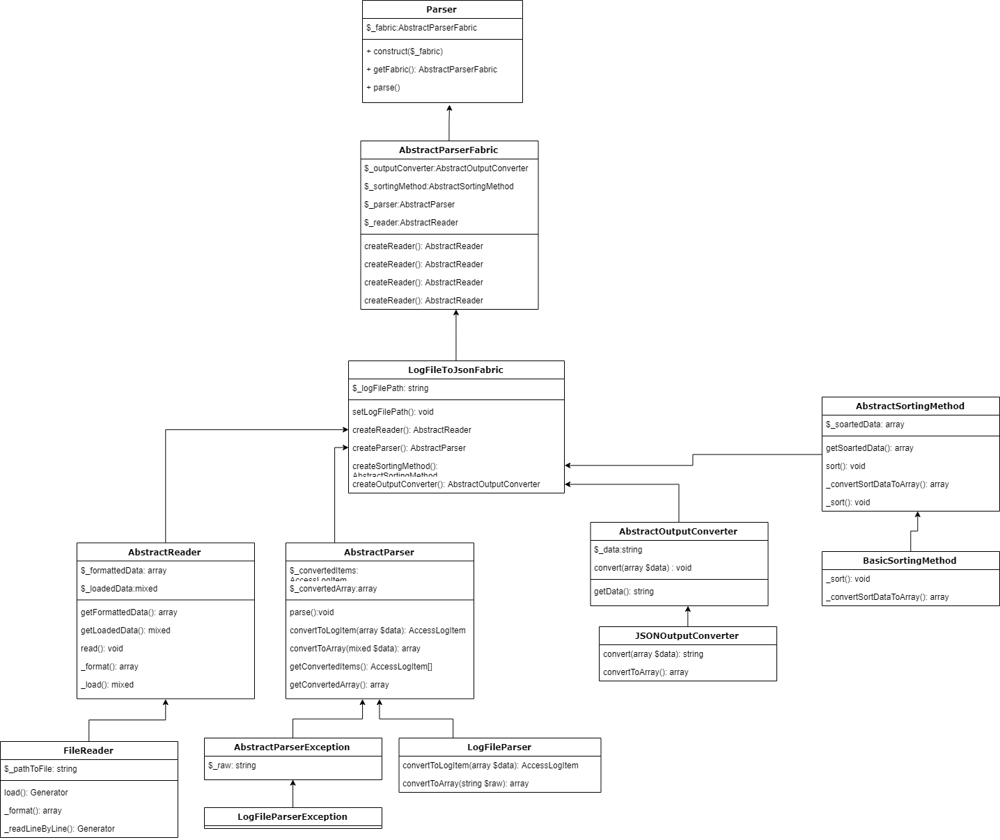

## 📖 Инструкция для Roistat 

Перейдите в директорию examples/ и запустите скрипт parser.php. Первый аргумент, это путь до вашего или моего access_log файла. Мои лежат в examples/access_logs.

```bash
cd examples && php parser.php access_logs/access_log1.log
```

### Вывод:
```JSON
{
    "views": 16,
    "urls": 3,
    "traffic": 187990,
    "crawlers": {
        "Google": 2,
        "Bing": 0,
        "Baidu": 0,
        "Yandex": 0
    },
    "statusCodes": {
        "200": 14,
        "301": 2
    }
}
```

## 📖 Также я приложу маленькую, но наглядную блок схему.
